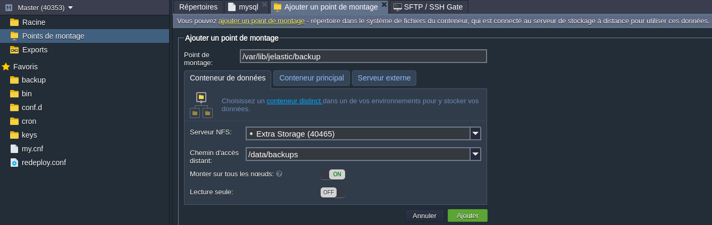

# Installation d'un cluster MySQL sur Jelastic Cloud

## Prérequis

 * Un compte sur jelastic cloud

## Création d'un environement

Sur https://app.jpe.infomaniak.com/

Lancer la création d'un nouvel environnement à partir de l'URL suivante en laissant les options par défaut:
https://github.com/jelastic-jps/mysql-cluster/blob/master/manifest.jps

L'installation comprend:

- 2 nœuds MySQL (Master-Slave)
- 2 nœuds ProxySQL pour la répartition des charges

Un fois l'installation terminée un email avec les informations de connexion sera envoyé.

Il faut ensuite modifier la topologie de l'environement et ajouter une IP publique à ProxySQL, sans ça la base de données n'est pas accessible depuis l'extérieur.

Pour plus d'informations: https://jelastic.com/blog/mysql-mariadb-database-auto-clustering-cloud-hosting/

## Activation du SSL

Pour les données qui transitent sur le web il est important de chiffrer les données, il est donc nécessaire d'activer le SSL au moins pour la connexion à ProxySQL.

Pour plus d'informations: https://proxysql.com/blog/ssl-at-proxysql-part1/

### SSL: Connexion à ProxySQL

La procédure suivante doit être réalisée sur chaque nœud ProxySQL, en SSH ou WebSSH:

```
$> mysql -h 127.0.0.1 -P6032 -uadmin -padmin
mysql> SET mysql-have_ssl = 1;
mysql> LOAD MYSQL VARIABLES TO RUNTIME;
mysql> SAVE MYSQL VARIABLES TO DISK;
```

Une fois que vous avez terminé, redémarrez les serveurs ProxySQL.

### SSL: ProxySQL -> MySQL

Le SSL pour la communication entre ProxySQL et MySQL est nécessaire pour les serveurs MySQL qui ne sont pas dans le même environement que ProxySQL.

Comme ProxySQL transfère le trafic vers tous les serveurs backend, nous devons conserver les mêmes fichiers `*.pem` sur toutes les instances de base de données. Vous pouvez copier les fichiers suivants de n'importe quel nœud de base de données vers tous les backends.

N'oubliez pas que vous devez changer leur propriété de l'utilisateur `root` à `mysql`.

```
-rw-r--r-- 1 mysql mysql 1.1K Mar 22 08:07 ca.pem
-rw------- 1 mysql mysql 1.7K Mar 22 08:07 ca-key.pem
-rw------- 1 mysql mysql 1.7K Mar 22 08:07 server-key.pem
-rw-r--r-- 1 mysql mysql 1.1K Mar 22 08:07 server-cert.pem
-rw------- 1 mysql mysql 1.7K Mar 22 08:07 client-key.pem
-rw-r--r-- 1 mysql mysql 1.1K Mar 22 08:07 client-cert.pem
-rw-r--r-- 1 mysql mysql  452 Mar 22 08:07 public_key.pem
-rw------- 1 mysql mysql 1.7K Mar 22 08:07 private_key.pem
```

Une fois que vous avez terminé, redémarrez les serveurs MySQL.

Nous devons maintenant transférer `ca.pem`, `client-cert.pem` et `client-key.pem` vers tous les serveurs ProxySQL dans le dossier `/var/lib/proxysql/`.

```
$> mysql -h 127.0.0.1 -P6032 -uadmin -padmin
mysql> UPDATE mysql_servers SET use_ssl=1 WHERE port=3306;
mysql> SET mysql-ssl_p2s_cert="/var/lib/proxysql/client-cert.pem";  
mysql> SET mysql-ssl_p2s_key="/var/lib/proxysql/client-key.pem";  
mysql> SET mysql-ssl_p2s_ca="/var/lib/proxysql/ca.pem";  
mysql> SET mysql-ssl_p2s_cipher='ECDHE-RSA-AES256-SHA';
mysql> LOAD MYSQL VARIABLES TO RUNTIME;
mysql> SAVE MYSQL VARIABLES TO DISK;
```

Une fois que vous avez terminé, redémarrez les serveurs ProxySQL.

Pour obliger les serveurs MySQL à verifier les certificats, vous pouvez ajouter les lignes suivantes dans le fichier `my.cnf` sous la catégorie `[mysqld]`:

```
ssl_ca=ca.pem
ssl_cert=client-cert.pem
ssl_key=client-key.pem
require_secure_transport=ON
```

Une fois que vous avez terminé, redémarrez les serveurs MySQL.

## Backups automatisés

Pour stocker vos backups de manière permanente vous devez modifier la topologie de l'environement pour y ajouter un conteneur de stockage.

Sur un des serveurs Mysql seulement, vous devez ajouter un point de montage comme sur l'image suivante.



Maintenant nous devons ajouter la ligne suivante dans le fichier `/var/spool/cron/mysql` en remplaçant `USER` et `PASSWORD`:

```
0 1 * * * /var/lib/jelastic/bin/backup_script.sh -m dump -c 10 -u USER -p PASSWORD -d oa
```
